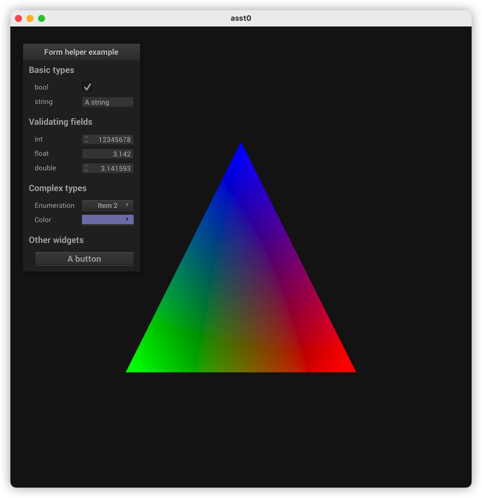

# Computer Animation and Gaming

## Getting started
The repo could be downloaded via below command:
```sh
git clone --recursive git@github.com:pzxszbry/ComputerAnimation_Assignment_0.git
```
This will create an asst0_environment folder with all the source files.

## Basic Environment Setup (MacOS)
```sh
# install Command Line Tools
xcode-select --install

# switch to CLT
sudo xcode-select -s /Library/Developer/CommandLineTools

# double check CLT path is configured
xcode-select -p

# install homebrew
/bin/bash -c "$(curl -fsSL https://raw.githubusercontent.com/Homebrew/install/HEAD/install.sh)"

# install cmake
brew install cmake

# check gcc version
gcc --version
```

### Build
```sh
# create build folder
cd ComputerAnimation_Assignment_0 && mkdir build && cd build

# build project
cmake ..
make
```

### Run

When you have successfully built your code, you will get an executable named **helloworld**. The helloworld executable do not take any argument. 

To run your executable file:
```sh
# under build folder
$ ./helloworld
```

When you first run the application, you will see a colored triangle on GUI.



## FAQ / Dependencies / Troubleshooting

There are several dependencies we need to rely on, but for most of them you do not need to do anything, we've configured all of them through CMake. This section is just for you to be aware of these dependencies. If you have any issue during building process, please double check following dependencies before coming to TA's office hour.


#### 1. C++11 and OpenGL

You **DO NOT** need XCode for this assignment, although **Command Line Tools** is required.
These two should already setup in MacOS by default. You can verify by running:
```
# shows gcc version
$ gcc -v 

# shows "/Library/Developer/CommandLineTools"
$ xcode-select -p

# if swith from xcode to CLT
$ sudo xcode-select -s /Library/Developer/CommandLineTools

# if not installed, then run
$ xcode-select --install
```

#### 2. GLEW

We provide GLEW in our library, therefore, you **DO NOT** need to do anything. 

However, some might encounter follwing issue during while running  ```make```:
```
ld: library not found for -lglew
```
and one possible solution (from StackOverlow [post](https://stackoverflow.com/questions/26430432/ld-library-not-found/26431115#26431115)), add following line to file ```~/.bash_profile```:
```
# double check your glew location
# ATTENTION: version number might be different!!!!
export LIBRARY_PATH="$LIBRARY_PATH:/usr/local/Cellar/glew/2.1.0_1/lib/"
```

If you want to use system GLEW, you can run following command to install GLEW then update CMakeLists.txt ON YOUR OWN.
```
######## OPTIONAL ######## 
$ brew install glew
# remember to update CMakeLists.txt
######## OPTIONAL ######## 
```

#### 3. NanoGUI

We setup these dependencies in our cmake/*.cmake files, therefore, you **DO NOT** need to do anything about it.


#### 4. GLFW

We will use the GLFW provided in NanoGUI, therefore, you **DO NOT** need to do anything. 

However, If you want to use system GLFW, you can run following command to install GLFW then update CMakeLists.txt ON YOUR OWN.
```
######## OPTIONAL ######## 
$ brew install glfw3
# remember to update CMakeLists.txt
######## OPTIONAL ######## 
```

#### 5. Freetype

This is required by lib CMU462, Freetype header files and dynamic library should be pre-installed on MacOS, therefore, you **DO NOT** need to do anything. 

However, some might encounter following issue while running ``cmake ..``:
```
Could NOT find Freetype (missing: FREETYPE_LIBRARY FREETYPE_INCLUDE_DIRS)
```
This is because your Mac does not have Freetype pre-installed for some reason, the solution would be simply just install it by running
```
brew install freetype
```


### Linux (In progress, please do not follow)
```
######## OPTIONAL ######## 
$ sudo apt-get install libxinerama-dev
$ sudo apt-get install libxcursor-dev
$ sudo apt-get install libglew-dev libglfw3 libglfw3-dev libglm-dev pkg-config
######## OPTIONAL ######## 
```


## Acknowledge

This repo use the **CMU462 Library** (https://github.com/cmu462/Scotty3D/tree/master/CMU462) for configuring OpenGL/GLFW/GLEW.

This repo also use **DownloadProject** (https://github.com/Crascit/DownloadProject) for downloading and configuring NanoGUI. 

